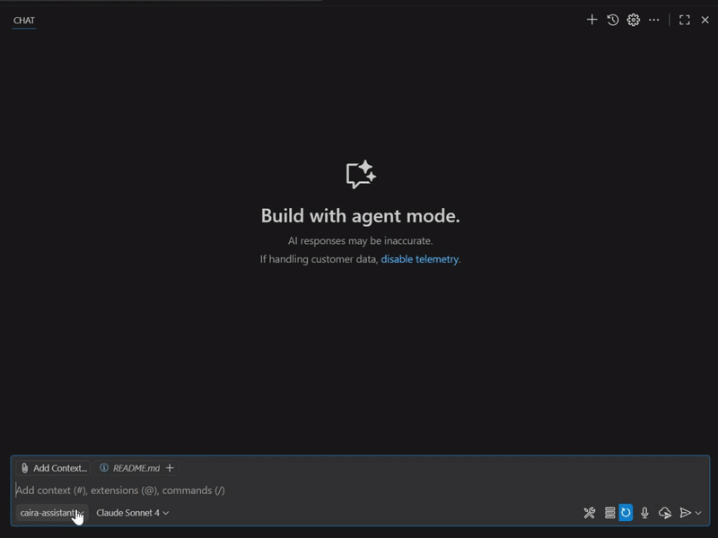

# CAIRA

**NOTE**: ⚠️ This project is under active development, is considered **pre-release software**, and may change without notice.

CAIRA (Composable AI Reference Architecture) is an infrastructure-as-code baseline that can accelerate the deployment of secure, observable AI-related environments in Azure. CAIRA is not a turnkey solution but an accelerator designed to reduce the setup time of different AI environments. It enables engineering teams to spin up AI environments which are observable and secure by design.

## Baseline Configurations

CAIRA provides several baseline configurations for Azure AI Foundry based solutions, so users can have a consistent, scalable, reliable deployment of Azure AI Foundry and supporting infrastructure in an accelerated time frame in support of agentic workloads.

Look [here for documentation](https://github.com/microsoft/CAIRA/tree/main/reference_architectures) that details the available configurations.

## Getting Started

To use CAIRA, you'll need to set up your development environment with the required tools and dependencies. The easiest way to do it is using the devcontainer provided in with the repository. If you rather configure the environment manually, follow the directions outlined in [Environment Setup](./docs/environment_setup.md)

Want to jump right into CAIRA? Here are the details on getting started!

1. Clone the repo: `git clone https://github.com/microsoft/CAIRA.git`
1. Start the devcontainer.
1. Explore and choose a configuration: Check the `/reference_architectures/` folder in this repository for a configuration that matches the baseline for your scenario. For example: `cd reference_architectures/foundry_basic`.
1. Explore the configuration and customize as needed. Installation steps can be found in the nested README.md file.
1. Happy AI-ing!

### New to CAIRA, Terraform or AI Foundry?

Try the 🤖 [CAIRA Assistant chat mode](./docs/chat_modes.md) for guided deployment assistance! After cloning the repo and starting the devcontainer, simply select "caira-assistant" chatmode in copilot and start chatting.

The CAIRA assistant will walk you through the entire deployment experience of all four reference architectures, validate any necessary prerequisite resources, and even help verify resources post-deployment.

## Contributing

This project welcomes contributions and suggestions. For detailed information, refer to the [Contributing Guide](CONTRIBUTING.md).

Most contributions require you to agree to a Contributor License Agreement (CLA) declaring that you have the right to, and actually do, grant us the rights to use your contribution. For details, visit <https://cla.opensource.microsoft.com>.

When you submit a pull request, a CLA bot will automatically determine whether you need to provide a CLA and decorate the PR appropriately (e.g., status check, comment). Simply follow the instructions provided by the bot. You will only need to do this once across all repos using our CLA.

This project has adopted the [Microsoft Open Source Code of Conduct](https://opensource.microsoft.com/codeofconduct/). For more information see the [Code of Conduct FAQ](https://opensource.microsoft.com/codeofconduct/faq/) or contact [opencode@microsoft.com](mailto:opencode@microsoft.com) with any additional questions or comments.

## Responsible AI

Microsoft encourages customers to review its Responsible AI Standard when developing AI-enabled systems to ensure ethical, safe, and inclusive AI practices. Learn more at [Responsible AI](https://www.microsoft.com/ai/responsible-ai).

## Security Posture

CAIRA reference architectures are designed to balance ease of deployment with security best practices. While the baseline configurations implement reasonable security controls, **production deployments will require additional security hardening**. For detailed information about security decisions, implementation patterns, and production recommendations, see our [Security Posture Documentation](./docs/security_posture.md).

## Data Collection

The software may collect information about you and your use of the software and send it to Microsoft. Microsoft may use this information to provide services and improve our products and services. You may turn off the telemetry as described in the repository. There are also some features in the software that may enable you and Microsoft to collect data from users of your applications. If you use these features, you must comply with applicable law, including providing appropriate notices to users of your applications together with a copy of Microsoft's privacy statement. Our privacy statement is located at <https://go.microsoft.com/fwlink/?LinkID=824704>. You can learn more about data collection and use in the help documentation and our privacy statement. Your use of the software operates as your consent to these practices.

- Azure Verified Modules (AVM) collect telemetry on deployments. This is documented [on the AVM website](https://azure.github.io/Azure-Verified-Modules/help-support/telemetry/).

The partner_id configuration in `reference_architectures/*/terraform.tf` enables telemetry that helps us justify ongoing investment in maintaining and improving this repository. Keeping this enabled supports the project and future feature development. When enabled, the partner_id is appended to the User-Agent on requests made by the configured terraform providers.

### Opting Out

To opt out of AVM and partner_id telemetry, set the variable `enable_telemetry` to `false`.

## Trademarks

This project may contain trademarks or logos for projects, products, or services. Authorized use of Microsoft trademarks or logos is subject to and must follow [Microsoft's Trademark & Brand Guidelines](https://www.microsoft.com/en-us/legal/intellectualproperty/trademarks/usage/general).
Use of Microsoft trademarks or logos in modified versions of this project must not cause confusion or imply Microsoft sponsorship. Any use of third-party trademarks or logos are subject to those third-party's policies.
